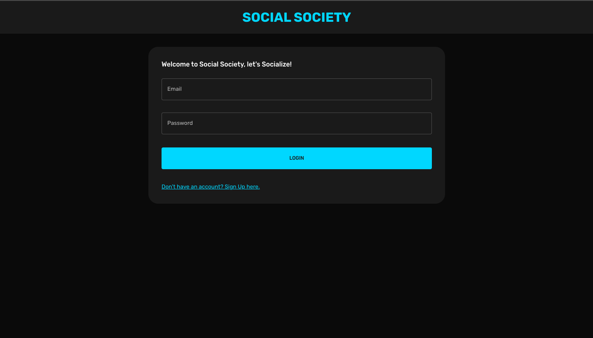
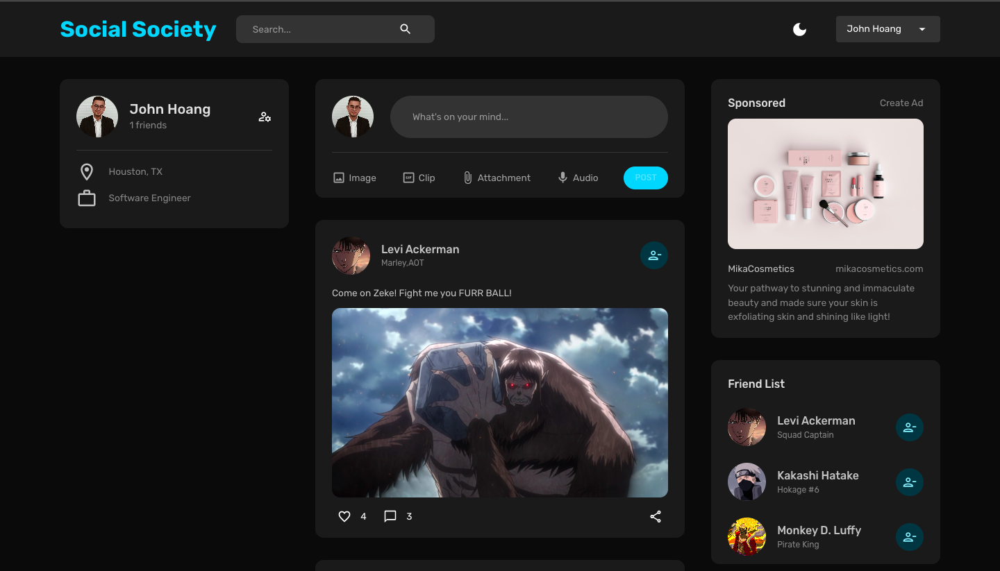
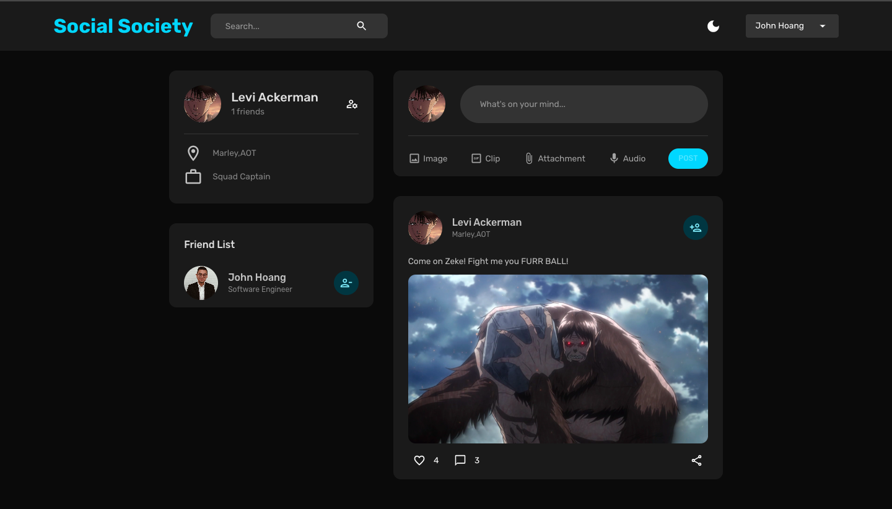

*"SOCIAL SOCIETY"*
===========
Learn more about the developer: 

LinkedIn: https://www.linkedin.com/in/nhathoangdev/

Portfolio: https://johnnhathoang.vercel.app/

*"SOCIAL SOCIETY"* is a Full-Responsive MERN Stack Social Media Application! Users can Register for a Profile with an E-Mail, Password, and a Photo! Users can then create post and add friends!

#### Technologies
MongoDB, Express, ReactJS, NodeJS

#### Version 2.0

###### Notifications
In the future, I'd like to add an option for users to get notifications on post or friend request.

###### Help
In the future, I'd like to add an option for users to ask for help.